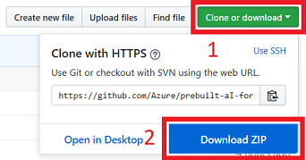
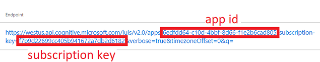

# Summary

Learn to quickly stand up a project-planning chat bot that uses LUIS for natural language understanding.

# Abstract

Conversational AI is any system that interacts with users via natural language inputs. Compared to traditional menu-driven bots, conversational AI is incredibly complex and relies on sophisticated Natural Language Processing (NLP) algorithms to derive understanding about what a user wants to do, and what things the user is talking about. This tutorial will guide you through the training and use of a Microsoft LUIS (Language Understanding Intelligent System) model that can understand user intent (what the user wants to do) and entities (names, places, things). You will use your trained model in the context of a text bot, built on the Microsoft Bot Framework, that can intelligently respond to user queries, given a small set of sample training data.

# Prerequisites

- Account on [luis.ai](https://www.luis.ai/) site (verify that you can login)
- [Node](https://nodejs.org/en/) 8+ (make sure you can type 'npm' at the command prompt)
- [Bot Framework Emulator](https://github.com/Microsoft/BotFramework-Emulator/releases/tag/v3.5.36) 3.x (use the *.exe for Windows; use the *-mac.zip for macOS)

# Setup Instructions

1. Download repo contents

   - Create a local working directory which we'll refer to as `<working-dir>` (Example: c:\luisbot)
   - Click **Clone or download** > **Download ZIP**
   
   - Save and extract the zip into `<working-dir>`

1. Set up LUIS

   - Navigate to **http://luis.ai/** and sign in
   - Click **Import new app**
   - Click **Browse** and select **`<working-dir>`\prebuilt-aI-for-conversational-bot\projectplanner.json** for App JSON file
   - Type a name for your app - please don't use the default "projectplanner"
   - Click **Done** > **Train** > **Publish** (use the default Production slot)
   - Scroll down to view the endpoint and make a note of the **app id** and **subscription key**. You will need them in the next section. For example:
   

1. Build and start bot

   - Open a command prompt and change the directory to **`<working-dir>`\prebuilt-aI-for-conversational-bot**
   - Edit **app.js** using your favorite editor or IDE
      - Replace **`<YOUR-APP-ID>`** with your **app id** from above
      - Replace **`<YOUR-SUBSCRIPTION-KEY>`** with your **subscription key** from above
   - Type **npm install**
   - Type **npm start**

# Usage

   - Start emulator and click **File** > **Open Bot**
   - Select the file **`<working-dir>`\prebuilt-aI-for-conversational-bot\luis-bot-es6.bot**
   - Type **Show me all docs for Wipro**
      > top intent: **FindDocForProject** 
      > confidence score: **0.778712034** 
      > entities: **wipro**
   - Type **Show me all people with Java programming skills**
      > top intent: **FindPeopleForProject** 
      > confidence score: **0.9460936** 
      > entities: **java**
   - Type **Show me all people who are free from September 2018 to November 2018**
      > top intent: **FinePeopleForProjectWithTime** 
      > confidence score: **0.932118058** 
      > entities: **(2018-09-01,2018-11-01,P2M),2018,2018**
   - Type **How are you?**
      > top intent: **Greeting** 
      > confidence score: **0.936847568** 
      > entities:
   - Type **Help**
      > top intent: **Help** 
      > confidence score: **0.9752868** 
      > entities:
   - Type **What is the weather like today?**
      > top intent: **None** 
      > confidence score: **0.57235** 
      > entities: **2018-07-16**

# Contributing

This project welcomes contributions and suggestions.  Most contributions require you to agree to a
Contributor License Agreement (CLA) declaring that you have the right to, and actually do, grant us
the rights to use your contribution. For details, visit https://cla.microsoft.com.

When you submit a pull request, a CLA-bot will automatically determine whether you need to provide
a CLA and decorate the PR appropriately (e.g., label, comment). Simply follow the instructions
provided by the bot. You will only need to do this once across all repos using our CLA.

This project has adopted the [Microsoft Open Source Code of Conduct](https://opensource.microsoft.com/codeofconduct/).
For more information see the [Code of Conduct FAQ](https://opensource.microsoft.com/codeofconduct/faq/) or
contact [opencode@microsoft.com](mailto:opencode@microsoft.com) with any additional questions or comments.

# Legal Notices

Microsoft and any contributors grant you a license to the Microsoft documentation and other content
in this repository under the [Creative Commons Attribution 4.0 International Public License](https://creativecommons.org/licenses/by/4.0/legalcode),
see the [LICENSE](LICENSE) file, and grant you a license to any code in the repository under the [MIT License](https://opensource.org/licenses/MIT), see the
[LICENSE-CODE](LICENSE-CODE) file.

Microsoft, Windows, Microsoft Azure and/or other Microsoft products and services referenced in the documentation
may be either trademarks or registered trademarks of Microsoft in the United States and/or other countries.
The licenses for this project do not grant you rights to use any Microsoft names, logos, or trademarks.
Microsoft's general trademark guidelines can be found at http://go.microsoft.com/fwlink/?LinkID=254653.

Privacy information can be found at https://privacy.microsoft.com/en-us/

Microsoft and any contributors reserve all others rights, whether under their respective copyrights, patents,
or trademarks, whether by implication, estoppel or otherwise.
